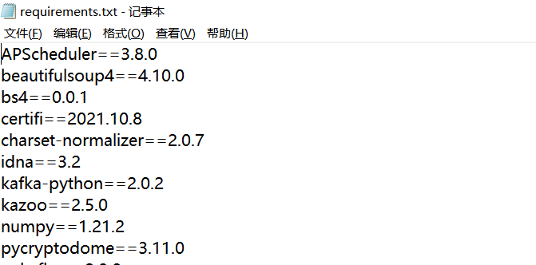

### [Python CLI](#)

`python 命令行！ 我们可以使用命令行来运行python代码，或者python文件！`

----

- [python 命令](#python-命令)
- [pip 命令](#pip-命令)


------

#### [Python 命令](#) 

运行python文件 index.py 然后传入参数 arg1 arg2 arg3!

```shell
python ./index.py arg1 arg2 arg3
```

python 查看帮助

```shell
python --help
```

python 查看当前帮助

```shell
python -V
python --version
```

直接输入python 命令进入命令行代码模式` `exit() 表示退出命令行！

```shell
PS E:\Codes\vccode\cs-paper> python
Python 3.10.8 (tags/v3.10.8:aaaf517, Oct 11 2022, 16:50:30) [MSC v.1933 64 bit (AMD64)] on win32
Type "help", "copyright", "credits" or "license" for more information.
>>> age = 23
>>> age + 12
35
>>> str = "hello world"
>>> str
'hello world'
>>> exit()
PS E:\Codecs\vccode\cs-paper> 
```


#### [pip 命令](#) 

pip 是 Python 包管理工具，该工具提供了对 Python 包的查找、下载、安装、卸载的功能。` `软件包也可以在 ` https://pypi.org/ `中找到。

查看是否已经安装 pip 可以使用以下命令：

```shell
pip --version
```

下载安装包使用以下命令：  `pip install some-package-name`

```shell
#例如我们安装 numpy 包：
pip install numpy
```

如果您需要特定版本，请运行以下命令：

```bash
# pip install package==version
pip install django==4.0.4
```

我们也可以轻易地通过以下的命令来移除软件包： `pip uninstall some-package-name`

```shell
#例如我们移除 numpy 包：
pip uninstall numpy
```

如果要查看我们已经安装的软件包，可以使用以下命令：

```shell
pip list
```

* `pip list --outdated` `列出哪些软件包已过期`
* `pip install --upgrade SomePackage`  `升级软件包` 

查看某个安装的包, **不支持了**

```shell
pip show numpy
#RuntimeError: PyPI no longer supports 'pip search' (or XML-RPC search).
```

检索命令` `搜索名称或摘要包含关键词的库，如pip search pygame将搜索PyPI中名称或摘要包含pygame的所有库，并将其列出  **已经被禁了**

```
pip search pygame            
```

**解决方法：**

```shell
pip install pip_search
```

```
pip_search tensorflow 
```

##### pip 查看帮助

```shell
pip -h
```

##### pip 更新升级
`可以更新自己也可以更新指定的包`

```shell
pip install --upgrade pip
pip install --upgrade pkgName
```

##### 查看兼容问题

在下载安装一些标准库的时候，需要考虑到兼容问题，一些标准库的安装可能需要依赖其他的标准库，会存在版本相冲突等问题，我们先用下面这条命令行来检查一下是否会有冲突的问题存在。

```go
pip check package_name
```

当然要是我们不指定是哪个标准库的话，会检查现在已经安装的所有包中的是否存在版本冲突等问题。

```shell
pip check
```

##### 指定国内源来安装

我们要是感觉到安装的速度有点慢，可以指定国内的源来安装某个包，例如

```go
pip install -i https://pypi.douban.com/simple/ package_name
```

国内的源:

* `清华`：https://pypi.tuna.tsinghua.edu.cn/simple
* `阿里云`：http://mirrors.aliyun.com/pypi/simple/
* `中国科技大学` https://pypi.mirrors.ustc.edu.cn/simple/
* `华中理工大学`：http://pypi.hustunique.com/
* `山东理工大学`：http://pypi.sdutlinux.org/ 
* `豆瓣`：http://pypi.douban.com/simple/

##### 下载包但是不安装

要是我们想要下载某个包到指定的路径下，命令行如下

```go
pip download package_name -d "某个路径"
```

##### requirements.txt

我们一般在看到别人的项目时，都会包含一个requirements.txt文件，里面包含了一些Python项目当中需要用到的第三方库

<div align=left>
    
</div>


要生成这种txt文件，需要这么来做

```
pip freeze > requirements.txt
```

而如果我们需要来批量安装第三方库，在命令行中输入以下这个命令

```
pip install -r requirements.txt
```

