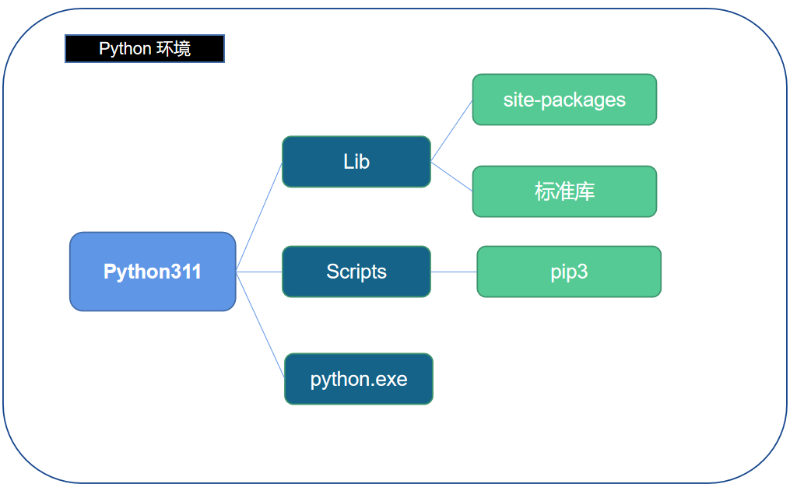
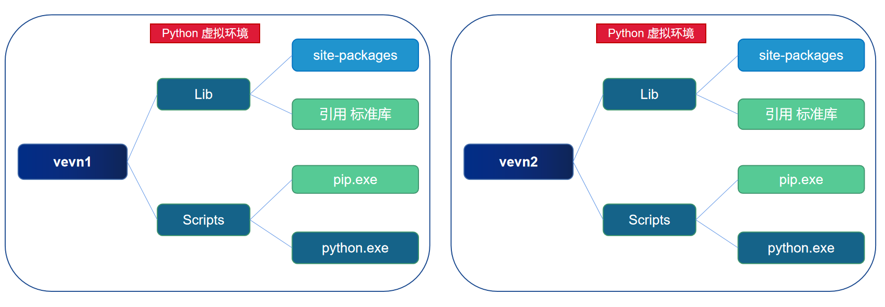
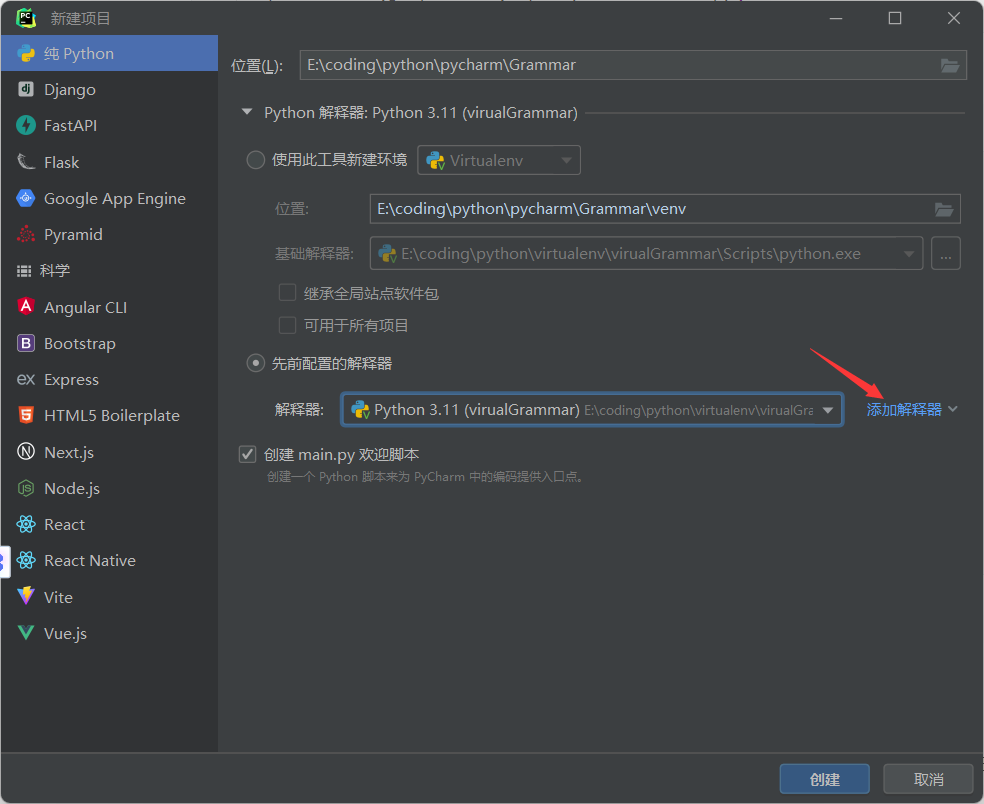
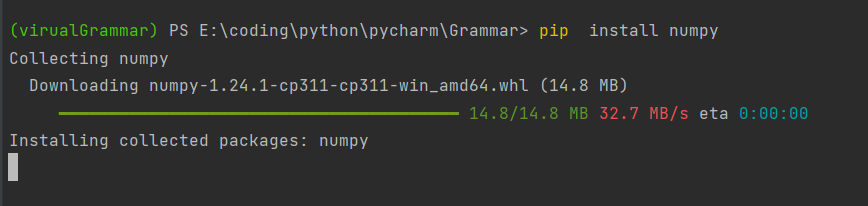
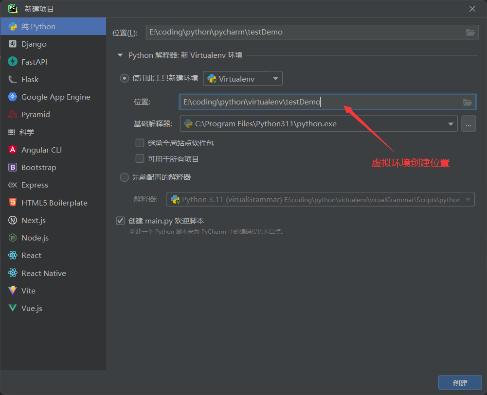

### [Python 虚拟环境](#)

-----

**为什么需要虚拟环境(Virtual Environment) ？**

Python 之所以强大，除了语言本身的特性外，更重要的是拥有无所不及的第三方库，通过 [pip(pip3)](#)来安装第三方包，但是由于pip的特性，系统中只能安装每个包的一个版本，很多时候不同的 Python 应用所依赖的版本是冲突的，满足了其中一个，另一个则无法运行，在实际项目开发中，不同项目可能需要第三方包的不同版本，迫使我们需要根据实际需求不断进行更新或卸载相应的包，而如果我们直接使用本地的Python环境，会导致整体的开发环境相当混乱而不易管理，这时候我们就需要开 辟一个独立干净的空间进行开发和部署，虚拟环境就孕育而生。

通过虚拟环境工具为项目创建**纯净**的依赖环境。

> 每个项目自己管理自己的包，而不是全部存储在一个地方，类似于 java的jar包、C#的Nuget。

虚拟环境是一个包含了特定 Python 解析器(python.exe)以及一些软件包的自包含目录，不同的应用程序可以使用不同的虚拟环境，从而解决了依赖冲突问题，而且虚拟环境中只需要安装应用相关的包或者模块，可以给部署提供便利。

[**例子说明：**](#)

**加入你需要安装一个 Flask web 框架，你会发现，会安装一堆的 python库，因为 Flask本身也依赖一堆其他的库，但是当你卸载  Flask的时候。**

```shell
python uninstall flask
```

你会发现只有flask 没卸载了，而伴随 flask一起安装的库，都没有被卸载，可想而知，为什么虚拟环境这么重要。

[**使用建议： 一个项目一个虚拟环境**](#)

[**虚拟环境并不是什么新技术，主要是利用了操作系统中环境变量以及进程间环境隔离的特性**](#)

可选的虚拟环境有几种： **Virtualenv**、**Pipenv**、**Poetry**、**conda**

### [1. 全局环境](#)

安装python的时候相当于安装了一个[全局的环境](#)：

* python安装目录\Lib\site-packages  site-packages目录下是python第三方包（也就是pip install 安装的包都在该目录下）
* 标准库就是原生库（`os,sys, math` 等等）
* Scripts下是可执行文件（`pip install` 时就会使用`pip.exe`这个可执行文件）
* python.exe就是`python`解释器

<div align=left>
    
</div>

**Python虚拟环境**可以看作是**真是Python环境的一个副本**，但是标准库都是一样的，每次都复制是不合算的,所以每次就不复制标准库，而是直接调用原来的标准库就行。

**为了和python全局环境有所区分，他们各自有自己的名字，例如 vevn1, vevn2。** **由于标准库是一样的，每个虚拟环境和全局环境使用同一个标准库， 所以**[**虚拟环境是不自带标准库的**](#)。

<div align=left>
    
</div>

**同时解释器也存到Scripts这个目录下**，**这样path环境变量只需要增加一个即可。** 安装python的时候 python.exe 和 pip.exe 在不同的目录下面，环境变量就有两个,我们以 win11. python 3.11版本为例，系统环境变量 path中有两个值。

```
C:\Program Files\Python311
C:\Program Files\Python311\Scripts
```

### [2. venv](#)

在 python3.3 之前，只能通过 virtualenv 创建虚拟环境，Python3.3 之后，可以用模块 venv 代替 virtualenv 工具，好处是不用单独安装，3.3 及之后的版本，都可以通过安装好的 Python 来创建虚拟环境:

```shell
python -m venv myvenv
```

可以在当前目录创建一个名为 myvenv 的虚拟环境

**python -m venv -h**   `查看帮助指南：`

```shell
usage: venv [-h] [--system-site-packages] [--symlinks | --copies] [--clear]
            [--upgrade] [--without-pip] [--prompt PROMPT] [--upgrade-deps]
            ENV_DIR [ENV_DIR ...]
# 用法: venv 
Creates virtual Python environments in one or more target directories.
# 在一个或多个目标目录中创建虚拟Python环境。 
positional arguments: # 位置参数
  ENV_DIR               A directory to create the environment in.
//ENV_DIR               在其中创建环境的目录。
options:
  -h, --help            show this help message and exit
  						# 显示此帮助消息并退出 
  --system-site-packages
                        Give the virtual environment access to the system
                        site-packages dir.
                        # 允许虚拟环境访问系统站点包目录。 
  --symlinks            Try to use symlinks rather than copies, when symlinks
                        are not the default for the platform.
                        # 当符号链接不是平台的默认链接时，请尝试使用符号链接而不是副本。
  --copies              Try to use copies rather than symlinks, even when
                        symlinks are the default for the platform.
                        # 尝试使用副本而不是符号链接，即使符号链接是平台的默认链接 
  --clear               Delete the contents of the environment directory if it
                        already exists, before environment creation.
                        # 如果环境目录已经存在，请在创建环境之前删除该目录的内容。
  --upgrade             Upgrade the environment directory to use this version
                        of Python, assuming Python has been upgraded in-place.
                        # 如果Python已经升级到位，请升级环境目录以使用此版本的Python。
  --without-pip         Skips installing or upgrading pip in the virtual
                        environment (pip is bootstrapped by default)
                        # 跳过在虚拟环境中安装或升级pip（默认情况下，pip是引导的）
  --prompt PROMPT       Provides an alternative prompt prefix for this
                        environment.
                        # 提供此环境的可选提示前缀。 
  --upgrade-deps        Upgrade core dependencies: pip setuptools to the
                        latest version in PyPI
						# 在PyPI中将核心依赖项：pip setuptools升级至最新版本 
Once an environment has been created, you may wish to activate it, e.g. by
sourcing an activate script in its bin directory.
#创建环境后，您可能希望激活它，例如在其bin目录中获取激活脚本。
```

####  [2.1 创建虚拟环境](#)

所以正常创建虚拟环境指令如下：`python -m venv 安装路径`  

```shell
python -m venv c:\path\to\myenv  #例子
```

在当前目录下安装 **virualGrammar** 这个虚拟环境

```shell
python -m venv virualGrammar
```

然后我们进入到目录里面，会发现文件结构如下所示:

```shell
Include
Lib
   ---- site-packages
Scripts
   ---- activate
   ---- activate.bat
   ---- Activate.ps1
   ---- deactivate.bat
   ---- pip.exe
   ---- pip3.11.exe
   ---- pip3.exe
   ---- python.exe
   ---- pythonw.exe
pyvenv.cfg
```

进入**Lib**查看目录结构：**无标准库**，有第三方库**site-packages**
进入**site-packages**查看目录结构：只有类似pip的少量包，是纯净的。

进入**Scripts**库查看目录结构：可以看到包括**pip.exe**和**python.exe**的可执行文件。由于使用虚拟环境是需要激活的，所以可以看到下面的文件：**activate是linux下的激活文件** ；
**activate.bat和Activate.ps1是windows下的激活文件；**

**deactivate.bat用来关闭虚拟环境。**

#### [2.2 激活虚拟环境](#)

直接激活虚拟环境, 激活虚拟环境，本质上是替换系统的环境变量，将虚拟环境的优先级放在最前面。

进入到 **virualGrammar/Scripts** 运行脚本：

```powershell
PS E:\coding\python\virtualenv\virualGrammar\Scripts> .\activate
(virualGrammar) PS E:\coding\python\virtualenv\virualGrammar\Scripts>
```

也会遇到一个问题:  **PowerShell因为在此系统中禁止执行脚本的解决方法, 所以无法激活！ 傻逼策略~**

**解决方法**：所以你需要允许脚本运行，百度一下很简单的！

```shell
 set-ExecutionPolicy RemoteSigned  #管理员身份打开powershell窗口  快捷键：win +X 
```

**激活成功后你会发现前面多了一个前缀：(virualGrammar)**

#### [2.3 查看环境区别](#)

**查看虚拟环境的python系统变量:**

```python
(virualGrammar) PS E:\coding\python\virtualenv\virualGrammar\Scripts> python
Python 3.11.1 (tags/v3.11.1:a7a450f, Dec  6 2022, 19:58:39) [MSC v.1934 64 bit (AMD64)] on win32
Type "help", "copyright", "credits" or "license" for more information.
>>> 50+ 56
106
>>> import sys
>>> from pprint import pprint
>>> pprint(sys.path) 
...
['',
 'C:\\Program Files\\Python311\\python311.zip',
 'C:\\Program Files\\Python311\\DLLs',
 'C:\\Program Files\\Python311\\Lib',
 'C:\\Program Files\\Python311',
 'E:\\coding\\python\\virtualenv\\virualGrammar',
 'E:\\coding\\python\\virtualenv\\virualGrammar\\Lib\\site-packages']
>>>
```

可以看到输出里面多了两行，指向python虚拟环境。

```python
 'E:\\coding\\python\\virtualenv\\virualGrammar',
 'E:\\coding\\python\\virtualenv\\virualGrammar\\Lib\\site-packages'
```

**另开一个窗口，打印全局python环境变量**

```python
PS C:\Users\remix> python
Python 3.11.1 (tags/v3.11.1:a7a450f, Dec  6 2022, 19:58:39) [MSC v.1934 64 bit (AMD64)] on win32
Type "help", "copyright", "credits" or "license" for more information.
>>> import sys
>>> from pprint import pprint
>>> pprint(sys.path)
['',
 'C:\\Program Files\\Python311\\python311.zip',
 'C:\\Program Files\\Python311\\Lib',
 'C:\\Program Files\\Python311\\DLLs',
 'C:\\Program Files\\Python311',
 'C:\\Program Files\\Python311\\Lib\\site-packages']
>>>
```

你就可以发现其中的差别了。

#### [2.4 系统环境变量Path的区别](#)

我们打印一下虚拟环境的环境变量和全局系统的环境变量：

**虚拟环境 path  `powershell`  如果是dos命令行 输入 `echo %PATH%`  **

```shell
(virualGrammar) PS E:\coding\python\virtualenv\virualGrammar\Scripts> $env:Path
E:\coding\python\virtualenv\virualGrammar\Scripts;  #看这里 这就是虚拟环境干的事情
C:\Windows\system32;
C:\Windows;
C:\Windows\System32\Wbem;
C:\Windows\System32\WindowsPowerShell\v1.0\;C:\Windows\System32\OpenSSH\;
D:\Program Files (x86)\NetSarang\Xshell 7\;
D:\Program Files (x86)\NetSarang\Xftp 7\;
C:\Program Files\Python311;
C:\Program Files\Python311\Scripts;
C:\Users\remix\AppData\Local\Microsoft\WindowsApps;
D:\Program Files\JetBrains\PyCharm 2022.3.1\bin;
```

**全局环境 path**  `powershell`  如果是dos命令行 输入 `echo %PATH%`  

```shell
PS C:\Users\remix> $env:Path
C:\Windows\system32;
C:\Windows;
C:\Windows\System32\Wbem;
C:\Windows\System32\WindowsPowerShell\v1.0\;
C:\Windows\System32\OpenSSH\;
D:\Program Files (x86)\NetSarang\Xshell 7\;
D:\Program Files (x86)\NetSarang\Xftp 7\;
C:\Program Files\Python311;
C:\Program Files\Python311\Scripts;
C:\Users\remix\AppData\Local\Microsoft\WindowsApps;
D:\Program Files\JetBrains\PyCharm 2022.3.1\bin;
C:\Program Files\Python311;
C:\Program Files\Python311\Scripts;
```

**也就是激活的本质就是插入一条环境变量，而抑制的作用就是删除这条环境变量：**

#### [2.5 不激活的使用方法](#)

了解了激活的本质，其实我们也可以不激活来使用环境变量， 使用pycharm创建新项目的时候，添加解释器，选择虚拟环境目录里面的解释器就行了。

<div align=left>
    
</div>
`main.py`

```python
import sys
from pprint import pprint

if __name__ == '__main__':
    pprint(sys.path)
"""
['E:\\coding\\python\\pycharm\\Grammar',
 'E:\\coding\\python\\pycharm\\Grammar',
 'D:\\Program Files\\JetBrains\\PyCharm '
 '2022.3.1\\plugins\\python\\helpers\\pycharm_display',
 'C:\\Program Files\\Python311\\python311.zip',
 'C:\\Program Files\\Python311\\DLLs',
 'C:\\Program Files\\Python311\\Lib',
 'C:\\Program Files\\Python311',
 'E:\\coding\\python\\virtualenv\\virualGrammar', ////虚拟环境
 'E:\\coding\\python\\virtualenv\\virualGrammar\\Lib\\site-packages', //虚拟环境
 'D:\\Program Files\\JetBrains\\PyCharm '
 '2022.3.1\\plugins\\python\\helpers\\pycharm_matplotlib_backend']
"""
```

**打开终端，就能看到前缀：**

<div align=left>
    
</div>

numpy 包将会安装到虚拟环境中！

#### [2.6 使用Pycharm 创建项目的时候自动创建虚拟环境](#)

很简单的,选一个虚拟环境位置就行了。

<div align=left>
    
</div>

#### [2.7 保存和恢复虚拟环境](#)

保存包的信息到文件 requirements.txt

```
(venvdemo) E:\coding\python\virtualenv\virualGrammar\Scripts>pip freeze >requirements.txt
```

使用`pip freeze >requirements.txt`命令将虚拟环境的库 冻结后存到**requirements.txt**文件里。

别人只需要通过`pip install -r requiremnets.txt`即可安装此项目运行需要的包。
